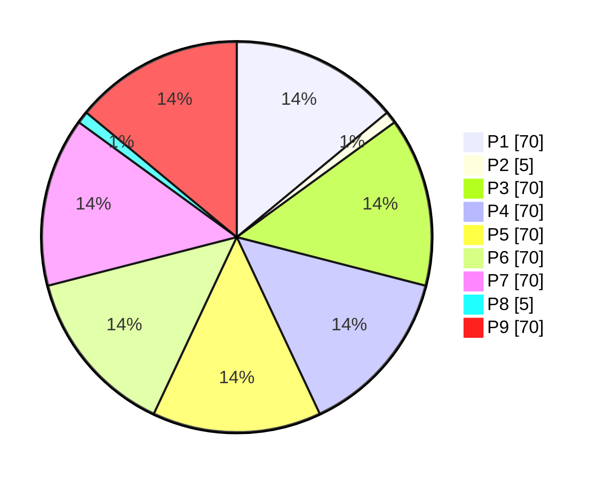

# Trader-Forge Debug Dashboard

**Phase (overall):** ❌ Failure  
**Overall Progress:** `70%`  `███████░░░`  
**Run:** <https://github.com/Azrea-Shade/Trader-Forge/actions/runs/17687069313>  
**Updated:** 2025-09-12 22:08:09 UTC

---

## Phase Overview (1–9)

- **Phase 1 — Foundations:** `70%`  `███████░░░`  ⚠️
- **Phase 2 — Core Shapes:** `5%`  `█░░░░░░░░░`  ❌
- **Phase 3 — Shell & Smoke:** `70%`  `███████░░░`  ⚠️
- **Phase 4 — Alerts & Watchlist:** `70%`  `███████░░░`  ⚠️
- **Phase 5 — Portfolio:** `70%`  `███████░░░`  ⚠️
- **Phase 6 — Scheduling:** `70%`  `███████░░░`  ⚠️
- **Phase 7 — Integrations:** `70%`  `███████░░░`  ⚠️
- **Phase 8 — UI/Presentation:** `5%`  `█░░░░░░░░░`  ❌
- **Phase 9 — Briefing:** `70%`  `███████░░░`  ⚠️

### Progress Pie

---

## History

- 2025-09-12 22:08:09 UTC — **❌ Failure** at `70%` — CI - Single (Windows build + unit tests)
  - Top errors:
    - error CS0111: Type 'AlertEngine' already defines a member called 'Evaluate' with the same parameter types [D:\a\Trader-Forge\Trader-Forge\src\Services\Services.csproj]
    - error CS0111: Type 'AlertEngine' already defines a member called 'EvaluateWithPrices' with the same parameter types [D:\a\Trader-Forge\Trader-Forge\src\Services\Services.csproj]
    - error CS0111: Type 'AlertEngine' already defines a member called 'EvaluateWithPricesFlattened' with the same parameter types [D:\a\Trader-Forge\Trader-Forge\src\Services\Services.csproj]
    - error CS0111: Type 'AlertEngine' already defines a member called 'Evaluate' with the same parameter types [D:\a\Trader-Forge\Trader-Forge\src\Services\Services.csproj]
    - error CS0111: Type 'AlertEngine' already defines a member called 'EvaluateWithPrices' with the same parameter types [D:\a\Trader-Forge\Trader-Forge\src\Services\Services.csproj]
    - error CS0111: Type 'AlertEngine' already defines a member called 'EvaluateWithPricesFlattened' with the same parameter types [D:\a\Trader-Forge\Trader-Forge\src\Services\Services.csproj]
  - Warnings:
    - warning NU1603: Unit depends on FluentAssertions (>= 6.14.0) but FluentAssertions 6.14.0 was not found. FluentAssertions 7.0.0 was resolved instead.
    - warning NU1603: Unit depends on FluentAssertions (>= 6.14.0) but FluentAssertions 6.14.0 was not found. FluentAssertions 7.0.0 was resolved instead.
    - warning CS8625: Cannot convert null literal to non-nullable reference type. [D:\a\Trader-Forge\Trader-Forge\src\Services\Services.csproj]
    - warning NU1603: Unit depends on FluentAssertions (>= 6.14.0) but FluentAssertions 6.14.0 was not found. FluentAssertions 7.0.0 was resolved instead.
    - warning CS8625: Cannot convert null literal to non-nullable reference type. [D:\a\Trader-Forge\Trader-Forge\src\Services\Services.csproj]

- 2025-09-12 22:02:23 UTC — **❌ Failure** at `70%` — CI - Single (Windows build + unit tests)
  - Top errors:
    - error CS1729: 'AlertEngine' does not contain a constructor that takes 1 arguments [D:\a\Trader-Forge\Trader-Forge\tests\Unit\Unit.csproj]
    - error CS1061: 'double' does not contain a definition for 'HasValue' and no accessible extension method 'HasValue' accepting a first argument of type 'double' could be found (are you missing a using directive or an assembly reference?) [D:\a\Trader-Forge\Trader-Forge\tests\Unit\Unit.csproj]
    - error CS1729: 'AlertEngine' does not contain a constructor that takes 1 arguments [D:\a\Trader-Forge\Trader-Forge\tests\Unit\Unit.csproj]
    - error CS1061: 'double' does not contain a definition for 'HasValue' and no accessible extension method 'HasValue' accepting a first argument of type 'double' could be found (are you missing a using directive or an assembly reference?) [D:\a\Trader-Forge\Trader-Forge\tests\Unit\Unit.csproj]
  - Warnings:
    - warning NU1603: Unit depends on FluentAssertions (>= 6.14.0) but FluentAssertions 6.14.0 was not found. FluentAssertions 7.0.0 was resolved instead.
    - warning NU1603: Unit depends on FluentAssertions (>= 6.14.0) but FluentAssertions 6.14.0 was not found. FluentAssertions 7.0.0 was resolved instead.
    - warning CS8625: Cannot convert null literal to non-nullable reference type. [D:\a\Trader-Forge\Trader-Forge\src\Presentation\Presentation_2z1igkxs_wpftmp.csproj]
    - warning CS8625: Cannot convert null literal to non-nullable reference type. [D:\a\Trader-Forge\Trader-Forge\src\Presentation\Presentation_2z1igkxs_wpftmp.csproj]
    - warning CS8625: Cannot convert null literal to non-nullable reference type. [D:\a\Trader-Forge\Trader-Forge\src\Presentation\Presentation.csproj]

- 2025-09-12 21:53:22 UTC — **❌ Failure** at `70%` — CI - Single (Windows build + unit tests)
  - Top errors:
    - error CS1729: 'AlertEngine' does not contain a constructor that takes 1 arguments [D:\a\Trader-Forge\Trader-Forge\src\Presentation\Presentation_3qrkvolw_wpftmp.csproj]
    - error CS0176: Member 'AlertEngine.Evaluate(object, object)' cannot be accessed with an instance reference; qualify it with a type name instead [D:\a\Trader-Forge\Trader-Forge\src\Presentation\Presentation_3qrkvolw_wpftmp.csproj]
    - error CS1503: Argument 1: cannot convert from 'long' to 'int' [D:\a\Trader-Forge\Trader-Forge\src\Presentation\Presentation_3qrkvolw_wpftmp.csproj]
    - error CS1729: 'AlertEngine' does not contain a constructor that takes 1 arguments [D:\a\Trader-Forge\Trader-Forge\src\Presentation\Presentation_3qrkvolw_wpftmp.csproj]
    - error CS0176: Member 'AlertEngine.Evaluate(object, object)' cannot be accessed with an instance reference; qualify it with a type name instead [D:\a\Trader-Forge\Trader-Forge\src\Presentation\Presentation_3qrkvolw_wpftmp.csproj]
    - error CS1503: Argument 1: cannot convert from 'long' to 'int' [D:\a\Trader-Forge\Trader-Forge\src\Presentation\Presentation_3qrkvolw_wpftmp.csproj]
  - Warnings:
    - warning NU1603: Unit depends on FluentAssertions (>= 6.14.0) but FluentAssertions 6.14.0 was not found. FluentAssertions 7.0.0 was resolved instead.
    - warning NU1603: Unit depends on FluentAssertions (>= 6.14.0) but FluentAssertions 6.14.0 was not found. FluentAssertions 7.0.0 was resolved instead.

- 2025-09-12 21:47:56 UTC — **❌ Failure** at `70%` — CI - Single (Windows build + unit tests)
  - Top errors:
    - error CS0723: Cannot declare a variable of static type 'AlertEngine' [D:\a\Trader-Forge\Trader-Forge\src\Presentation\Presentation_w2ivvt1c_wpftmp.csproj]
    - error CS0723: Cannot declare a variable of static type 'AlertEngine' [D:\a\Trader-Forge\Trader-Forge\src\Presentation\Presentation_w2ivvt1c_wpftmp.csproj]
  - Warnings:
    - warning NU1603: Unit depends on FluentAssertions (>= 6.14.0) but FluentAssertions 6.14.0 was not found. FluentAssertions 7.0.0 was resolved instead.
    - warning NU1603: Unit depends on FluentAssertions (>= 6.14.0) but FluentAssertions 6.14.0 was not found. FluentAssertions 7.0.0 was resolved instead.

- 2025-09-12 21:43:55 UTC — **❌ Failure** at `70%` — CI - Single (Windows build + unit tests)
  - Top errors:
    - error CS1061: 'double' does not contain a definition for 'HasValue' and no accessible extension method 'HasValue' accepting a first argument of type 'double' could be found (are you missing a using directive or an assembly reference?) [D:\a\Trader-Forge\Trader-Forge\tests\Unit\Unit.csproj]
    - error CS1061: 'double' does not contain a definition for 'HasValue' and no accessible extension method 'HasValue' accepting a first argument of type 'double' could be found (are you missing a using directive or an assembly reference?) [D:\a\Trader-Forge\Trader-Forge\tests\Unit\Unit.csproj]
  - Warnings:
    - warning NU1603: Unit depends on FluentAssertions (>= 6.14.0) but FluentAssertions 6.14.0 was not found. FluentAssertions 7.0.0 was resolved instead.
    - warning SYSLIB0050: 'FormatterServices' is obsolete: 'Formatter-based serialization is obsolete and should not be used.' (https://aka.ms/dotnet-warnings/SYSLIB0050) [D:\a\Trader-Forge\Trader-Forge\tests\Unit\Unit.csproj]
    - warning CS8625: Cannot convert null literal to non-nullable reference type. [D:\a\Trader-Forge\Trader-Forge\tests\Unit\Unit.csproj]
    - warning NU1603: Unit depends on FluentAssertions (>= 6.14.0) but FluentAssertions 6.14.0 was not found. FluentAssertions 7.0.0 was resolved instead.
    - warning SYSLIB0050: 'FormatterServices' is obsolete: 'Formatter-based serialization is obsolete and should not be used.' (https://aka.ms/dotnet-warnings/SYSLIB0050) [D:\a\Trader-Forge\Trader-Forge\tests\Unit\Unit.csproj]

- 2025-09-12 21:39:43 UTC — **❌ Failure** at `70%` — CI - Single (Windows build + unit tests)
  - Top errors:
    - error CS1061: 'double' does not contain a definition for 'HasValue' and no accessible extension method 'HasValue' accepting a first argument of type 'double' could be found (are you missing a using directive or an assembly reference?) [D:\a\Trader-Forge\Trader-Forge\tests\Unit\Unit.csproj]
    - error CS1061: 'double' does not contain a definition for 'HasValue' and no accessible extension method 'HasValue' accepting a first argument of type 'double' could be found (are you missing a using directive or an assembly reference?) [D:\a\Trader-Forge\Trader-Forge\tests\Unit\Unit.csproj]
  - Warnings:
    - warning NU1603: Unit depends on FluentAssertions (>= 6.14.0) but FluentAssertions 6.14.0 was not found. FluentAssertions 7.0.0 was resolved instead.
    - warning SYSLIB0050: 'FormatterServices' is obsolete: 'Formatter-based serialization is obsolete and should not be used.' (https://aka.ms/dotnet-warnings/SYSLIB0050) [D:\a\Trader-Forge\Trader-Forge\tests\Unit\Unit.csproj]
    - warning CS8625: Cannot convert null literal to non-nullable reference type. [D:\a\Trader-Forge\Trader-Forge\tests\Unit\Unit.csproj]
    - warning NU1603: Unit depends on FluentAssertions (>= 6.14.0) but FluentAssertions 6.14.0 was not found. FluentAssertions 7.0.0 was resolved instead.
    - warning SYSLIB0050: 'FormatterServices' is obsolete: 'Formatter-based serialization is obsolete and should not be used.' (https://aka.ms/dotnet-warnings/SYSLIB0050) [D:\a\Trader-Forge\Trader-Forge\tests\Unit\Unit.csproj]

- 2025-09-12 21:24:55 UTC — **❌ Failure** at `70%` — CI - Single (Windows build + unit tests)
  - Top errors:
    - error CS1061: 'GenericCollectionAssertions<DateTime>' does not contain a definition for 'Be' and no accessible extension method 'Be' accepting a first argument of type 'GenericCollectionAssertions<DateTime>' could be found (are you missing a using directive or an assembly reference?) [D:\a\Trader-Forge\Trader-Forge\tests\Unit\Unit.csproj]
    - error CS1061: 'GenericCollectionAssertions<DateTime>' does not contain a definition for 'Be' and no accessible extension method 'Be' accepting a first argument of type 'GenericCollectionAssertions<DateTime>' could be found (are you missing a using directive or an assembly reference?) [D:\a\Trader-Forge\Trader-Forge\tests\Unit\Unit.csproj]
    - error CS1061: 'GenericCollectionAssertions<DateTime>' does not contain a definition for 'Be' and no accessible extension method 'Be' accepting a first argument of type 'GenericCollectionAssertions<DateTime>' could be found (are you missing a using directive or an assembly reference?) [D:\a\Trader-Forge\Trader-Forge\tests\Unit\Unit.csproj]
    - error CS1061: 'GenericCollectionAssertions<DateTime>' does not contain a definition for 'Be' and no accessible extension method 'Be' accepting a first argument of type 'GenericCollectionAssertions<DateTime>' could be found (are you missing a using directive or an assembly reference?) [D:\a\Trader-Forge\Trader-Forge\tests\Unit\Unit.csproj]
    - error CS1061: 'double' does not contain a definition for 'HasValue' and no accessible extension method 'HasValue' accepting a first argument of type 'double' could be found (are you missing a using directive or an assembly reference?) [D:\a\Trader-Forge\Trader-Forge\tests\Unit\Unit.csproj]
    - error CS1061: '(AlertResult alert, double? price)' does not contain a definition for 'Id' and no accessible extension method 'Id' accepting a first argument of type '(AlertResult alert, double? price)' could be found (are you missing a using directive or an assembly reference?) [D:\a\Trader-Forge\Trader-Forge\tests\Unit\Unit.csproj]
  - Warnings:
    - warning NU1603: Unit depends on FluentAssertions (>= 6.14.0) but FluentAssertions 6.14.0 was not found. FluentAssertions 7.0.0 was resolved instead.
    - warning SYSLIB0050: 'FormatterServices' is obsolete: 'Formatter-based serialization is obsolete and should not be used.' (https://aka.ms/dotnet-warnings/SYSLIB0050) [D:\a\Trader-Forge\Trader-Forge\tests\Unit\Unit.csproj]
    - warning CS8625: Cannot convert null literal to non-nullable reference type. [D:\a\Trader-Forge\Trader-Forge\tests\Unit\Unit.csproj]
    - warning NU1603: Unit depends on FluentAssertions (>= 6.14.0) but FluentAssertions 6.14.0 was not found. FluentAssertions 7.0.0 was resolved instead.

- 2025-09-12 21:20:55 UTC — **❌ Failure** at `70%` — CI - Single (Windows build + unit tests)
  - Top errors:
    - error CS1061: 'double' does not contain a definition for 'HasValue' and no accessible extension method 'HasValue' accepting a first argument of type 'double' could be found (are you missing a using directive or an assembly reference?) [D:\a\Trader-Forge\Trader-Forge\tests\Unit\Unit.csproj]
    - error CS1061: 'double' does not contain a definition for 'HasValue' and no accessible extension method 'HasValue' accepting a first argument of type 'double' could be found (are you missing a using directive or an assembly reference?) [D:\a\Trader-Forge\Trader-Forge\tests\Unit\Unit.csproj]
  - Warnings:
    - warning NU1603: Unit depends on FluentAssertions (>= 6.14.0) but FluentAssertions 6.14.0 was not found. FluentAssertions 7.0.0 was resolved instead.
    - warning SYSLIB0050: 'FormatterServices' is obsolete: 'Formatter-based serialization is obsolete and should not be used.' (https://aka.ms/dotnet-warnings/SYSLIB0050) [D:\a\Trader-Forge\Trader-Forge\tests\Unit\Unit.csproj]
    - warning CS8625: Cannot convert null literal to non-nullable reference type. [D:\a\Trader-Forge\Trader-Forge\tests\Unit\Unit.csproj]
    - warning NU1603: Unit depends on FluentAssertions (>= 6.14.0) but FluentAssertions 6.14.0 was not found. FluentAssertions 7.0.0 was resolved instead.

- 2025-09-12 21:15:25 UTC — **❌ Failure** at `70%` — CI - Single (Windows build + unit tests)
  - Top errors:
    - error CS0428: Cannot convert method group 'HasValue' to non-delegate type 'bool'. Did you intend to invoke the method? [D:\a\Trader-Forge\Trader-Forge\tests\Unit\Unit.csproj]
    - error CS1662: Cannot convert lambda expression to intended delegate type because some of the return types in the block are not implicitly convertible to the delegate return type [D:\a\Trader-Forge\Trader-Forge\tests\Unit\Unit.csproj]
    - error CS0428: Cannot convert method group 'HasValue' to non-delegate type 'bool'. Did you intend to invoke the method? [D:\a\Trader-Forge\Trader-Forge\tests\Unit\Unit.csproj]
    - error CS1662: Cannot convert lambda expression to intended delegate type because some of the return types in the block are not implicitly convertible to the delegate return type [D:\a\Trader-Forge\Trader-Forge\tests\Unit\Unit.csproj]
  - Warnings:
    - warning NU1603: Unit depends on FluentAssertions (>= 6.14.0) but FluentAssertions 6.14.0 was not found. FluentAssertions 7.0.0 was resolved instead.
    - warning CS8625: Cannot convert null literal to non-nullable reference type. [D:\a\Trader-Forge\Trader-Forge\tests\Unit\Unit.csproj]
    - warning SYSLIB0050: 'FormatterServices' is obsolete: 'Formatter-based serialization is obsolete and should not be used.' (https://aka.ms/dotnet-warnings/SYSLIB0050) [D:\a\Trader-Forge\Trader-Forge\tests\Unit\Unit.csproj]
    - warning NU1603: Unit depends on FluentAssertions (>= 6.14.0) but FluentAssertions 6.14.0 was not found. FluentAssertions 7.0.0 was resolved instead.

- 2025-09-12 21:08:20 UTC — **❌ Failure** at `70%` — CI - Single (Windows build + unit tests)
  - Top errors:
    - error CS1061: 'GenericCollectionAssertions<DateTime>' does not contain a definition for 'Be' and no accessible extension method 'Be' accepting a first argument of type 'GenericCollectionAssertions<DateTime>' could be found (are you missing a using directive or an assembly reference?) [D:\a\Trader-Forge\Trader-Forge\tests\Unit\Unit.csproj]
    - error CS1061: 'GenericCollectionAssertions<DateTime>' does not contain a definition for 'Be' and no accessible extension method 'Be' accepting a first argument of type 'GenericCollectionAssertions<DateTime>' could be found (are you missing a using directive or an assembly reference?) [D:\a\Trader-Forge\Trader-Forge\tests\Unit\Unit.csproj]
    - error CS1061: 'GenericCollectionAssertions<DateTime>' does not contain a definition for 'Be' and no accessible extension method 'Be' accepting a first argument of type 'GenericCollectionAssertions<DateTime>' could be found (are you missing a using directive or an assembly reference?) [D:\a\Trader-Forge\Trader-Forge\tests\Unit\Unit.csproj]
    - error CS1061: 'GenericCollectionAssertions<DateTime>' does not contain a definition for 'Be' and no accessible extension method 'Be' accepting a first argument of type 'GenericCollectionAssertions<DateTime>' could be found (are you missing a using directive or an assembly reference?) [D:\a\Trader-Forge\Trader-Forge\tests\Unit\Unit.csproj]
    - error CS1061: 'double' does not contain a definition for 'HasValue' and no accessible extension method 'HasValue' accepting a first argument of type 'double' could be found (are you missing a using directive or an assembly reference?) [D:\a\Trader-Forge\Trader-Forge\tests\Unit\Unit.csproj]
    - error CS1061: 'GenericCollectionAssertions<DateTime>' does not contain a definition for 'Be' and no accessible extension method 'Be' accepting a first argument of type 'GenericCollectionAssertions<DateTime>' could be found (are you missing a using directive or an assembly reference?) [D:\a\Trader-Forge\Trader-Forge\tests\Unit\Unit.csproj]
  - Warnings:
    - warning NU1603: Unit depends on FluentAssertions (>= 6.14.0) but FluentAssertions 6.14.0 was not found. FluentAssertions 7.0.0 was resolved instead.
    - warning SYSLIB0050: 'FormatterServices' is obsolete: 'Formatter-based serialization is obsolete and should not be used.' (https://aka.ms/dotnet-warnings/SYSLIB0050) [D:\a\Trader-Forge\Trader-Forge\tests\Unit\Unit.csproj]
    - warning CS8625: Cannot convert null literal to non-nullable reference type. [D:\a\Trader-Forge\Trader-Forge\tests\Unit\Unit.csproj]
    - warning NU1603: Unit depends on FluentAssertions (>= 6.14.0) but FluentAssertions 6.14.0 was not found. FluentAssertions 7.0.0 was resolved instead.
