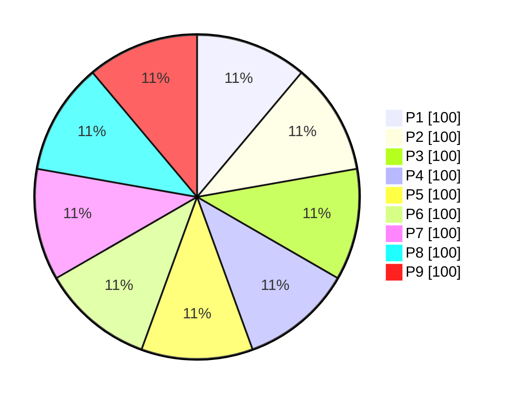

# 🛠️ Trader-Forge — Debug Dashboard

**Status:** ❌ Failure  
**MAIN:** `85%`  `█████████░`  
**CI:** `70%`  `███████░░░`  
**Run:** <https://github.com/Azrea-Shade/Trader-Forge/actions/runs/17701456885>  
**Updated:** 2025-09-13 20:11:11 UTC

---
## 📊 Phase Progress
✅ **Phase 1 — Foundations**  100%  `██████████`
✅ **Phase 2 — Core Shapes**  100%  `██████████`
✅ **Phase 3 — Shell/Smoke**  100%  `██████████`
✅ **Phase 4 — Alerts Eval**  100%  `██████████`
✅ **Phase 5 — Portfolio**  100%  `██████████`
✅ **Phase 6 — Scheduling**  100%  `██████████`
✅ **Phase 7 — Infra**  100%  `██████████`
✅ **Phase 8 — App Glue**  100%  `██████████`
✅ **Phase 9 — Briefing**  100%  `██████████`

### 🥧 Progress Pie

```mermaid
pie showData
  "P1" : 100
  "P2" : 100
  "P3" : 100
  "P4" : 100
  "P5" : 100
  "P6" : 100
  "P7" : 100
  "P8" : 100
  "P9" : 100
```

---
## ✅ / ⚠️ TODOs (this run)
- CS1061: 'double' does not contain a definition for 'HasValue' and no accessible extension method 'HasValue' accepting a first argument of type 'double' could be found (are you missing a using directive or an assembly reference?)

---
## 🧾 History
- 2025-09-13 20:11:11 UTC — **❌ Failure** · MAIN `85%` (CI `70%`) — CI - Single (Windows build + unit tests)
- 2025-09-13 20:04:30 UTC — **❌ Failure** · MAIN `85%` (CI `70%`) — CI - Single (Windows build + unit tests)
- 2025-09-13 19:20:01 UTC — **❌ Failure** · MAIN `85%` (CI `70%`) — CI - Single (Windows build + unit tests)
