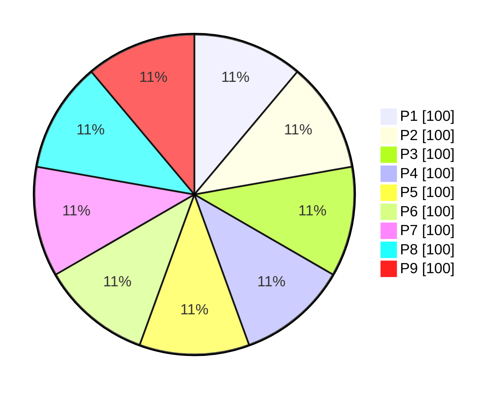

# 🛠️ Trader-Forge — Debug Dashboard

**Overall:** ❌ Failure  
**MAIN Progress:** `85%`  `█████████░`  
**CI Steps:** `70%`  `███████░░░`  
**Run:** <https://github.com/Azrea-Shade/Trader-Forge/actions/runs/17700967684>  
**Updated:** 2025-09-13 19:20:01 UTC

---

## 📊 Phase Progress (1–9)
✅ **Phase 1 — Foundations** 100%  `██████████░`
✅ **Phase 2 — Core Shapes** 100%  `██████████░`
✅ **Phase 3 — Shell/Smoke** 100%  `██████████░`
✅ **Phase 4 — Alerts Eval** 100%  `██████████░`
✅ **Phase 5 — Portfolio** 100%  `██████████░`
✅ **Phase 6 — Scheduling** 100%  `██████████░`
✅ **Phase 7 — Infra** 100%  `██████████░`
✅ **Phase 8 — App Glue** 100%  `██████████░`
✅ **Phase 9 — Briefing** 100%  `██████████░`

### 🥧 Progress Pie

```mermaid
pie showData
  "P1" : 100
  "P2" : 100
  "P3" : 100
  "P4" : 100
  "P5" : 100
  "P6" : 100
  "P7" : 100
  "P8" : 100
  "P9" : 100
```

---

## ✅ / ⚠️ TODOs from this run
- error CS0234: The type or namespace name 'AlertEngineAlias' does not exist in the namespace 'Services.Engines' (are you missing an assembly reference?) [D:\a\Trader-Forge\Trader-Forge\src\Presentation\Presentation_1p22g111_wpftmp.csproj]
- error CS0234: The type or namespace name 'AlertEngineAlias' does not exist in the namespace 'Services.Engines' (are you missing an assembly reference?) [D:\a\Trader-Forge\Trader-Forge\src\Presentation\Presentation_1p22g111_wpftmp.csproj]
- error CS0234: The type or namespace name 'AlertResultAlias' does not exist in the namespace 'Services.Engines' (are you missing an assembly reference?) [D:\a\Trader-Forge\Trader-Forge\src\Presentation\Presentation_1p22g111_wpftmp.csproj]
- error CS0234: The type or namespace name 'AlertResultAlias' does not exist in the namespace 'Services.Engines' (are you missing an assembly reference?) [D:\a\Trader-Forge\Trader-Forge\src\Presentation\Presentation_1p22g111_wpftmp.csproj]
- error CS0234: The type or namespace name 'AlertEngineAlias' does not exist in the namespace 'Services.Engines' (are you missing an assembly reference?) [D:\a\Trader-Forge\Trader-Forge\src\Presentation\Presentation_1p22g111_wpftmp.csproj]
- error CS0234: The type or namespace name 'AlertEngineAlias' does not exist in the namespace 'Services.Engines' (are you missing an assembly reference?) [D:\a\Trader-Forge\Trader-Forge\src\Presentation\Presentation_1p22g111_wpftmp.csproj]
- error CS0234: The type or namespace name 'AlertResultAlias' does not exist in the namespace 'Services.Engines' (are you missing an assembly reference?) [D:\a\Trader-Forge\Trader-Forge\src\Presentation\Presentation_1p22g111_wpftmp.csproj]
- error CS0234: The type or namespace name 'AlertResultAlias' does not exist in the namespace 'Services.Engines' (are you missing an assembly reference?) [D:\a\Trader-Forge\Trader-Forge\src\Presentation\Presentation_1p22g111_wpftmp.csproj]

**Warnings**
- warning NU1603: Unit depends on FluentAssertions (>= 6.14.0) but FluentAssertions 6.14.0 was not found. FluentAssertions 7.0.0 was resolved instead.
- warning CS0105: The using directive for 'Services.Engines' appeared previously in this namespace [D:\a\Trader-Forge\Trader-Forge\src\Presentation\Presentation_1p22g111_wpftmp.csproj]
- warning NU1603: Unit depends on FluentAssertions (>= 6.14.0) but FluentAssertions 6.14.0 was not found. FluentAssertions 7.0.0 was resolved instead.
- warning CS0105: The using directive for 'Services.Engines' appeared previously in this namespace [D:\a\Trader-Forge\Trader-Forge\src\Presentation\Presentation_1p22g111_wpftmp.csproj]

---

## 🧾 History
- 2025-09-13 19:20:01 UTC — **❌ Failure** · MAIN `85%` (CI `70%`) — CI - Single (Windows build + unit tests)
