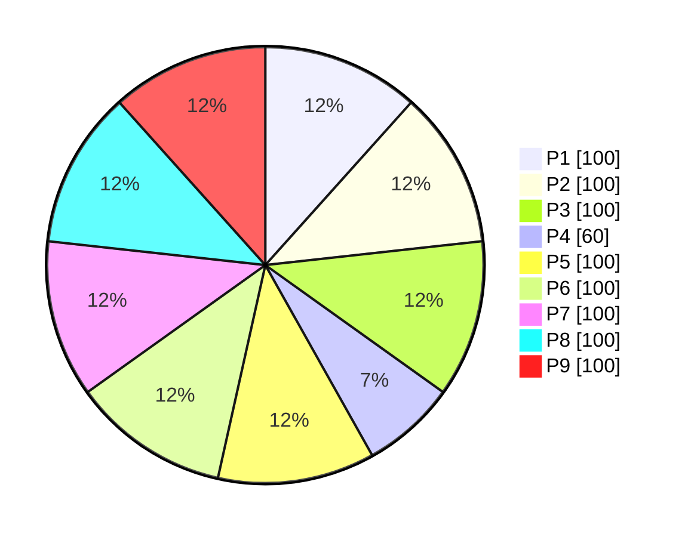

# 🛠️ Trader-Forge — Debug Dashboard

**Status:** ❌ Failure  
**MAIN:** 82% `████████░░`  
**CI:** 70% `███████░░░`  
**Run:** <https://github.com/Azrea-Shade/Trader-Forge/actions/runs/17714134458>  
**Updated:** 2025-09-14 17:07:01 UTC

## 📊 Phase Progress
| # | Phase       | %  | Bar          |
|---|-------------|----|--------------|
| 1 | Foundations | 100 | `██████████░` |
| 2 | Core Shapes | 100 | `██████████░` |
| 3 | Shell/Smoke | 100 | `██████████░` |
| 4 | Alerts Eval | 60 | `██████░░░░` |
| 5 | Portfolio   | 100 | `██████████░` |
| 6 | Scheduling  | 100 | `██████████░` |
| 7 | Infra       | 100 | `██████████░` |
| 8 | App Glue    | 100 | `██████████░` |
| 9 | Briefing    | 100 | `██████████░` |

### 🥧 Progress Pie

```mermaid
pie showData
  "P1" : 100
  "P2" : 100
  "P3" : 100
  "P4" : 60
  "P5" : 100
  "P6" : 100
  "P7" : 100
  "P8" : 100
  "P9" : 100
```

## ✅ / ⚠️ TODOs (this run)
- error CS0266: Cannot implicitly convert type 'System.Collections.Generic.IEnumerable<Services.Engines.AlertResult>' to 'System.Collections.Generic.IEnumerable<(int Id, bool TriggeredAbove, bool TriggeredBelow)>'. An explicit conversion exists (are you missing a cast?) [D:\a\Trader-Forge\Trader-Forge\src\Presentation\Presentation_srhir3md_wpftmp.csproj]
- error CS0266: Cannot implicitly convert type 'System.Collections.Generic.IEnumerable<Services.Engines.AlertResult>' to 'System.Collections.Generic.IEnumerable<(int Id, bool TriggeredAbove, bool TriggeredBelow)>'. An explicit conversion exists (are you missing a cast?) [D:\a\Trader-Forge\Trader-Forge\src\Presentation\Presentation_srhir3md_wpftmp.csproj]

---
## 🧾 History
- 2025-09-14 17:07:01 UTC — **Failure** · MAIN `82%` (CI `70%`) — CI - Single (Windows build + unit tests)
- 2025-09-14 17:00:27 UTC — **Failure** · MAIN `85%` (CI `70%`) — CI - Single (Windows build + unit tests)
- 2025-09-13 21:28:52 UTC — **Failure** · MAIN `85%` (CI `70%`) — CI - Single (Windows build + unit tests)
- 2025-09-13 21:21:34 UTC — **Failure** · MAIN `80%` (CI `70%`) — CI - Single (Windows build + unit tests)
- 2025-09-13 20:32:44 UTC — **Failure** · MAIN `85%` (CI `70%`) — CI - Single (Windows build + unit tests)
- 2025-09-13 20:11:11 UTC — **❌ Failure** · MAIN `85%` (CI `70%`) — CI - Single (Windows build + unit tests)
- 2025-09-13 20:04:30 UTC — **❌ Failure** · MAIN `85%` (CI `70%`) — CI - Single (Windows build + unit tests)
- 2025-09-13 19:20:01 UTC — **❌ Failure** · MAIN `85%` (CI `70%`) — CI - Single (Windows build + unit tests)
