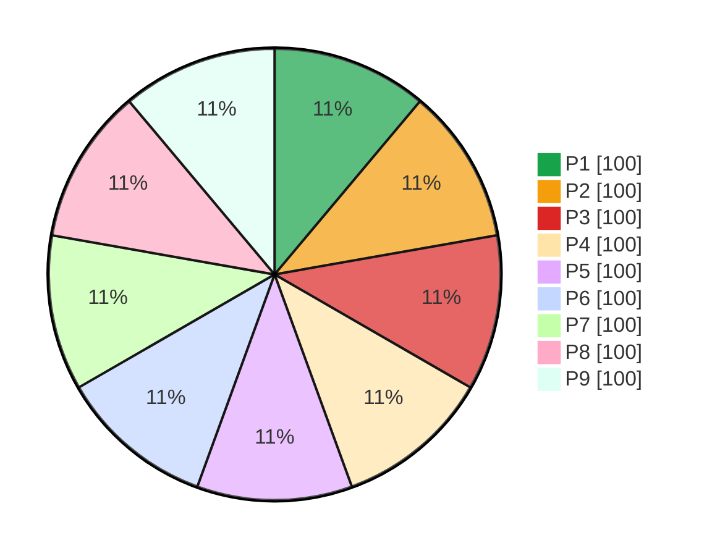

# 🛠️ Trader-Forge — Debug Dashboard

**Status:** ❌ Failure  
**MAIN:** 85% `█████████░`  
**CI:** 70% `███████░░░`  
**Run:** <https://github.com/Azrea-Shade/Trader-Forge/actions/runs/17701687602>  
**Updated:** 2025-09-13 20:32:44 UTC

## 📊 Phase Progress
| # | Phase | % | Bar |
|---|-------|---|-----|
| 1 | Foundations | 100% | `██████████░` |
| 2 | Core Shapes | 100% | `██████████░` |
| 3 | Shell/Smoke | 100% | `██████████░` |
| 4 | Alerts Eval | 100% | `██████████░` |
| 5 | Portfolio | 100% | `██████████░` |
| 6 | Scheduling | 100% | `██████████░` |
| 7 | Infra | 100% | `██████████░` |
| 8 | App Glue | 100% | `██████████░` |
| 9 | Briefing | 100% | `██████████░` |

**Legend:** ✅ Done (≥90) • ⚠️ In progress (10–89) • ❌ Blocked (<10)

### 🥧 Progress Pie

```mermaid
%%{init: {'theme':'base','themeVariables':{'pie1':'#16a34a','pie2':'#f59e0b','pie3':'#dc2626','fontFamily':'Inter'}}}%%
pie showData
  "P1" : 100
  "P2" : 100
  "P3" : 100
  "P4" : 100
  "P5" : 100
  "P6" : 100
  "P7" : 100
  "P8" : 100
  "P9" : 100
```

## ✅ / ⚠️ TODOs (this run)
- error CS0266: Cannot implicitly convert type 'System.Collections.Generic.IEnumerable<(int Id, bool TriggeredAbove, bool TriggeredBelow)>' to 'System.Collections.Generic.IEnumerable<Services.Engines.AlertResult>'. An explicit conversion exists (are you missing a cast?) [D:\a\Trader-Forge\Trader-Forge\src\Presentation\Presentation_dcc5tgth_wpftmp.csproj]
- error CS0266: Cannot implicitly convert type 'System.Collections.Generic.IEnumerable<(int Id, bool TriggeredAbove, bool TriggeredBelow, double? Price)>' to 'System.Collections.Generic.IEnumerable<(Services.Engines.AlertResult alert, double? price)>'. An explicit conversion exists (are you missing a cast?) [D:\a\Trader-Forge\Trader-Forge\src\Presentation\Presentation_dcc5tgth_wpftmp.csproj]
- error CS0266: Cannot implicitly convert type 'System.Collections.Generic.IEnumerable<(int Id, bool TriggeredAbove, bool TriggeredBelow)>' to 'System.Collections.Generic.IEnumerable<Services.Engines.AlertResult>'. An explicit conversion exists (are you missing a cast?) [D:\a\Trader-Forge\Trader-Forge\src\Presentation\Presentation_dcc5tgth_wpftmp.csproj]
- error CS0266: Cannot implicitly convert type 'System.Collections.Generic.IEnumerable<(int Id, bool TriggeredAbove, bool TriggeredBelow, double? Price)>' to 'System.Collections.Generic.IEnumerable<(Services.Engines.AlertResult alert, double? price)>'. An explicit conversion exists (are you missing a cast?) [D:\a\Trader-Forge\Trader-Forge\src\Presentation\Presentation_dcc5tgth_wpftmp.csproj]

---
## 🧾 History
- 2025-09-13 20:32:44 UTC — **Failure** · MAIN `85%` (CI `70%`) — CI - Single (Windows build + unit tests)
- 2025-09-13 20:11:11 UTC — **❌ Failure** · MAIN `85%` (CI `70%`) — CI - Single (Windows build + unit tests)
- 2025-09-13 20:04:30 UTC — **❌ Failure** · MAIN `85%` (CI `70%`) — CI - Single (Windows build + unit tests)
- 2025-09-13 19:20:01 UTC — **❌ Failure** · MAIN `85%` (CI `70%`) — CI - Single (Windows build + unit tests)
